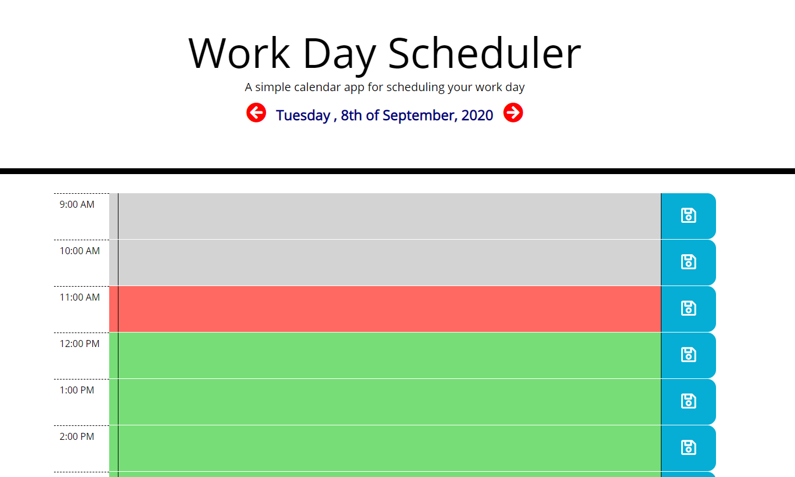
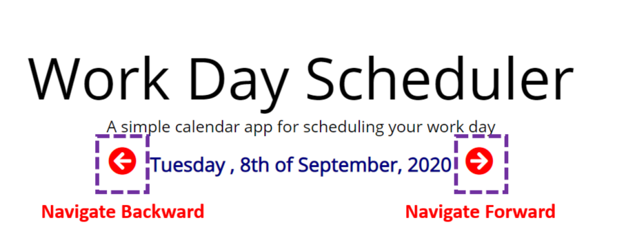

# Work Day Scheduler
## Description
This is a simple Work Day Scheduler. The application uses localStorage to store the data the user enters. The application uses `moment.js` library for easier date and time access.

* The app renders the info. from localStorage everytime the page loads or user navigates between different days and populates them to the user so they can add or modify them.

* The app allows users to navigate in dates forwards and backwards, using arrows next to the displayed date.

## Features
* Start at current date

* All past times/dates will have a grey background and the present time will be red and the future dates/times will be green. 

* You can click the arrows to navigate freely between dates. 

## Test
You may try the Work Scheduler by simply following the link to [Work  Day scheduler](https://tonymelek.github.io/work_day_scheduler/).

## Feedback
You are welecome to provide any feedback or comments on the code to be sent to my e-mail [tonymelek.au@gmail.com](mailto:tonymelek.au@gmail.com)

## License
Work Day Scheduler is &copy; copyight to Tony Melek 2020
